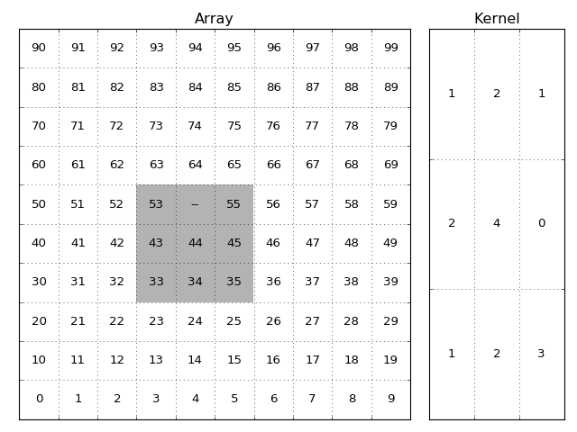
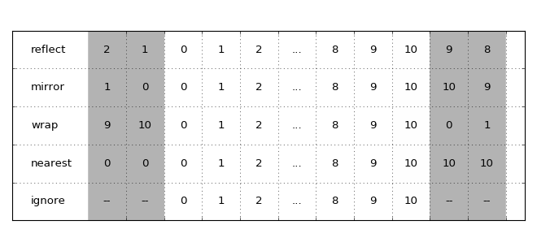

Filter for masked arrays
------------------------

``numbamisc`` includes several filter (convolution) functions:

- ``sum_filter``
- ``average_filter``

as well as the following rank filters:

- ``median_filter``
- ``median_filter_weighted``
- ``min_filter``
- ``max_filter``

The main difference to the ones in other libraries is that these handle masked
arrays. However this imposes some restrictions as well:

- The kernel for ``sum_filter`` and ``average_filter`` must not contain mixed
  positive and negative values.

- The functions are slower because they cannot exploit common filter
  optimizations.

Masks
^^^^^

Each filter function accepts a ``mask`` argument. But for some data types it
is not necessary to specify it explicitly. For example if the ``data`` argument
is a

- ``numpy.ma.MaskedArray``
- ``astropy.nddata.NDData``

object then it's mask will be used by default!

It's possible to override this by explicitly passing in a ``mask``.

Kernels
^^^^^^^

The kernel is an array of weights that is applied to each local neighborhood to
calculate the resulting filtered value. The kernel has different
interpretations depending on the kind of filter.

- For ``sum_filter`` and ``average_filter`` it represents an array of weights.

- For ``median_filter``, ``min_filter`` and ``max_filter`` it represents a
  boolean condition if the values should be taken into account.

- For ``median_filter_weighted`` it represents integer weights.

   The image and kernel. The grey shadowed part of the array are the elements
   used when calculating the result of the (x=5, y=4) item. The ``--``
   represents a masked value.

   The value of the output element will be:

   ``1*53 + 0(2*'--') + 1*55 + 2*43 + 4*44 + 0*45 + 1*33 + 2*34 + 3*35``

   divided by the sum of the valid kernel elements:

   ``1+0+1+2+4+0+1+2+3``

   and in case of ``sum_filter`` thereafter multiplied by the total sum of
   kernel elements.

   ``1+2+1+2+4+0+1+2+3``

..
    import numpy as np
    import matplotlib.pyplot as plt
    fig, (ax1, ax2) = plt.subplots(ncols=2, gridspec_kw = {'width_ratios': [3, 1]})
    data = np.arange(100).reshape(10, 10)
    for y, line in enumerate(data):
        for x, item in enumerate(line):
            c = str(item)
            if (x, y) == (4, 5):
                c = '--'
            ax1.text(x, y, c, va='center', ha='center')
    valid_data = np.ones((10, 10))
    valid_data[3:6, 3:6] = 0
    ax1.imshow(valid_data, interpolation='none', alpha=0.3, cmap=plt.cm.gray)
    ax1.set_title('Array')
    ax1.set_xticks(np.arange(10)+0.5)
    ax1.set_yticks(np.arange(10)+0.5)
    ax1.set_xticklabels([])
    ax1.set_yticklabels([])
    ax1.set_xlim(-0.5, 9.5)
    ax1.set_ylim(-0.5, 9.5)
    ax1.grid()
    kernel = np.array([[1, 2, 3], [2, 4, 0], [1, 2, 1]])
    for y, line in enumerate(kernel):
        for x, item in enumerate(line):
            c = str(item)
            ax2.text(x, y, c, va='center', ha='center')
    ax2.set_title('Kernel')
    ax2.set_xticks(np.arange(3)+0.5)
    ax2.set_yticks(np.arange(3)+0.5)
    ax2.set_xticklabels([])
    ax2.set_yticklabels([])
    ax2.set_xlim(-0.5, 2.5)
    ax2.set_ylim(-0.5, 2.5)
    ax2.grid()
    plt.tight_layout()

To ease using the kernel there are some shortcuts if the kernel is simple, if
the ``kernel`` argument is an:

- ``int``, then it's assumed that this integer gives the shape in all dimensions
  and the kernel should contain ones. For example when the data has 3 dimensions
  and ``kernel=4`` is used then internally the kernel will be converted to
  ``np.ones((4, 4, 4))``.

- ``tuple``, then this will be used as ``shape`` argument for a kernel containing
  ones: ``np.ones(kernel)``.

- ``astropy.convolution.Kernel``, then it's array attribute is used.

Otherwise an explicit ``numpy.array`` object is expected.

Border handling
^^^^^^^^^^^^^^^

These filters accept the following ``border`` arguments:

- ``ignore`` (default)
- ``reflect``
- ``mirror``
- ``nearest``
- ``wrap``

Except for ``ignore`` (which ignores values outside the array) these are used
to specify how the array is padded if the ``kernel`` goes outside the array
grid.

   How the options affect how the array is padded. The grey areas indicate the
   padded values.

..
   import numpy as np
   import matplotlib.pyplot as plt
   fig, ax = plt.subplots()
   data = np.arange(10)
   data = [['ignore', '', '--', '--', 0, 1, 2, '...', 8, 9, 10, '--', '--'],
            ['nearest', '', 0, 0, 0, 1, 2, '...', 8, 9, 10, 10, 10],
            ['wrap', '', 9, 10, 0, 1, 2, '...', 8, 9, 10, 0, 1],
            ['mirror', '', 1, 0, 0, 1, 2, '...', 8, 9, 10, 10, 9],
            ['reflect', '', 2, 1, 0, 1, 2, '...', 8, 9, 10, 9, 8],
           ]
    for y, line in enumerate(data):
        for x, item in enumerate(line):
            c = str(item)
            ha = 'center' if x else 'left'
            ax.text(x-2, y, c, va='center', ha=ha)
    valid_data = np.ones((5, 11))
    valid_data[:, 0:2] = 0
    valid_data[:, -2:] = 0
    plt.imshow(valid_data, interpolation='none', alpha=0.3, cmap=plt.cm.gray)
    ax.set_xticks(np.arange(12)+0.5)
    ax.set_yticks(np.arange(5)+0.5)
    ax.set_xticklabels([])
    ax.set_yticklabels([])
    ax.set_xlim(-2.5, 11)
    ax.set_ylim(-0.5, 4.5)
    ax.grid()
    plt.tight_layout()
    plt.show()

NaN handling
^^^^^^^^^^^^

Each filter has the option to also treat ``NaN`` values as masked. Just pass
``ignore_nan=True`` to the filter function.
